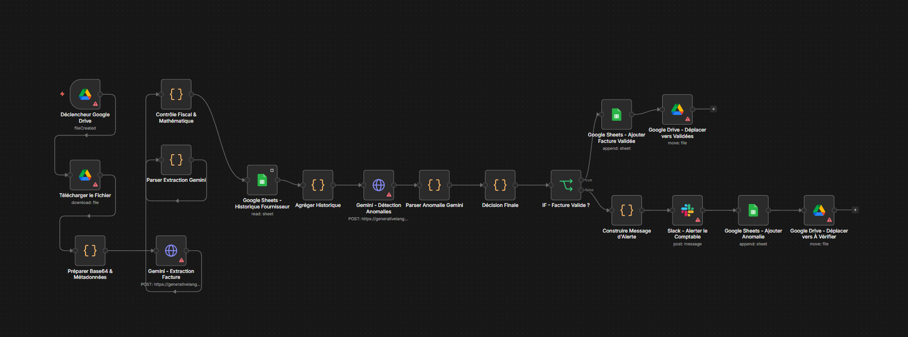

# 🧾 Audit et Contrôle Automatisé des Factures Fournisseurs

J'ai développé ce workflow n8n pour automatiser le processus de vérification des factures avant leur saisie comptable. L'objectif est d'éliminer les erreurs de calcul manuel, de vérifier la conformité fiscale marocaine, et de détecter les anomalies (doublons, fraudes) grâce à un premier niveau d'analyse par OCR/LLM combiné à des scripts métiers personnalisés.

## ⚙️ Architecture du Workflow

Ce processus prend en charge une facture dès sa réception et passe par 4 étapes clés :

1. **Extraction de données :** Récupération automatique du PDF/Image depuis Google Drive et extraction structurée (JSON) via l'API Gemini.
2. **Contrôle Métier & Fiscal (Script Custom) :** C'est le cœur du système. J'ai écrit un script JavaScript pour valider les règles suivantes :
   - Conformité de l'équation mathématique (`HT + TVA = TTC`).
   - Validation de l'ICE (Identifiant Commun de l'Entreprise) à 15 chiffres.
   - Cohérence du taux de TVA appliqué selon la nature de l'opération (ex: 14% pour le transport, 20% pour les services).
3. **Analyse d'Historique :** Croisement de la facture actuelle avec la base de données (Google Sheets) pour repérer les doublons ou les montants anormaux pour un fournisseur spécifique.
4. **Routage et Alerte :** 
   - Les factures valides sont logguées et archivées.
   - Toute anomalie déclenche une alerte immédiate sur Slack/WhatsApp avec le détail de l'erreur pour vérification humaine.

## 🛠️ Stack & Outils Utilisés
- **n8n** : Orchestration du workflow.
- **JavaScript (ES6)** : Programmation de la logique de contrôle fiscal et mathématique (Code Nodes).
- **Google Gemini API** : Pour la partie extraction (Vision/OCR) et parsing JSON.
- **Google Workspace** : Drive (Stockage) et Sheets (Base de données/Registre).
- **Slack API** : Pour les notifications.

## 📂 Structure des fichiers
- `workflow.json` : Le fichier d'export du workflow complet à importer dans n8n.
- `logique-fiscale.js` : Le script JavaScript métier utilisé pour la validation mathématique et fiscale.

## 🚀 Comment l'utiliser
1. Importez `workflow.json` dans votre instance n8n.
2. Configurez vos identifiants (Google, Gemini, Slack).
3. Adaptez les règles de TVA dans le nœud "Contrôle Fiscal & Mathématique" selon la législation de votre pays si différent du Maroc.
